> [!IMPORTANT]
>  Must run crawler everytime before analyzing data in Quicksight. Run Crawler with name **batteriesforecast** before running **estorage-forecast-dataprep-ff** step function. 

## Step to run crawler:

**1.** Navigate to AWS console for **AWS Glue** 

**2.** Expand **Data catalog** from side Panel and click on **Crawler**

**3.** Select crawler with name **batteriesforecast** and click on **Run**

## Step to run Step function:

**1.** Navigate to AWS console for **Step Function**

**2.** Choose the created Step Function with name **estorage-forecast-dataprep-ff** and click on it to open this Step function.

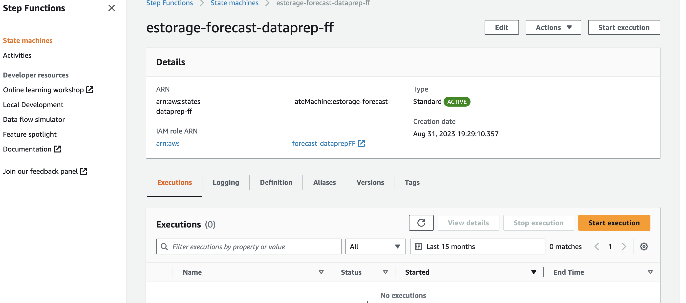

**3.** Select the highlighted **start execution** and then again click on **start execution**

## QuickSight Section : To visualize the data from different source in Amazon QuickSight do the following Setup:- 

> [!IMPORTANT]
> You can only visualize the data in QuickSight once the data start coming Real source or generated data is passed for testing purpose.

1. - Search for QuickSight in the search bar and select it

 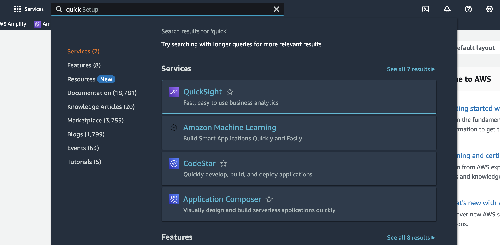

2. - Click on **Sign Up** for QuickSight

 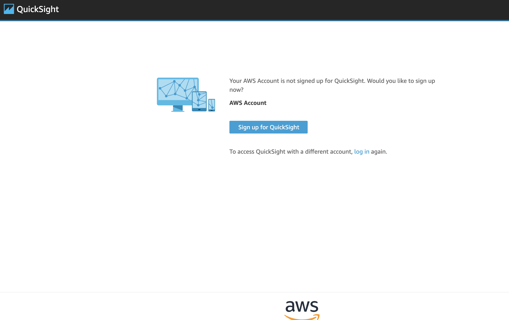

3. - Select any one of the plan based on your need either Enterprise or Enterprise + Q

  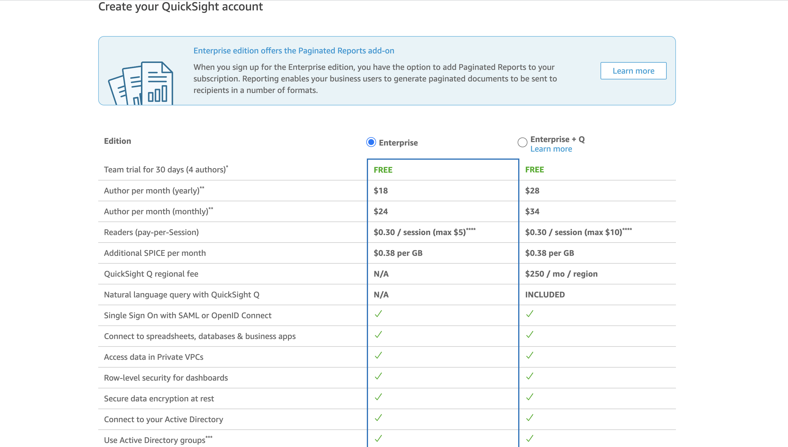

4. - In next step if you want Get Paginated Report add-on, then select on either of Yes or select No.

  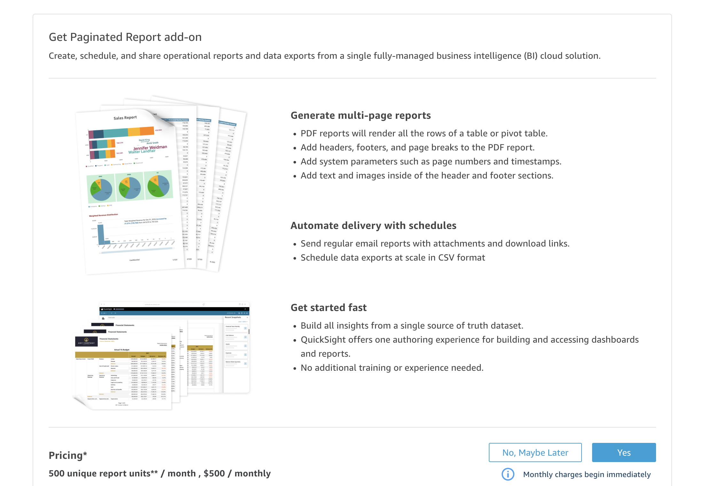

5. - In authentication method select : Use IAM **federated identities** & **QuickSight-managed users**

  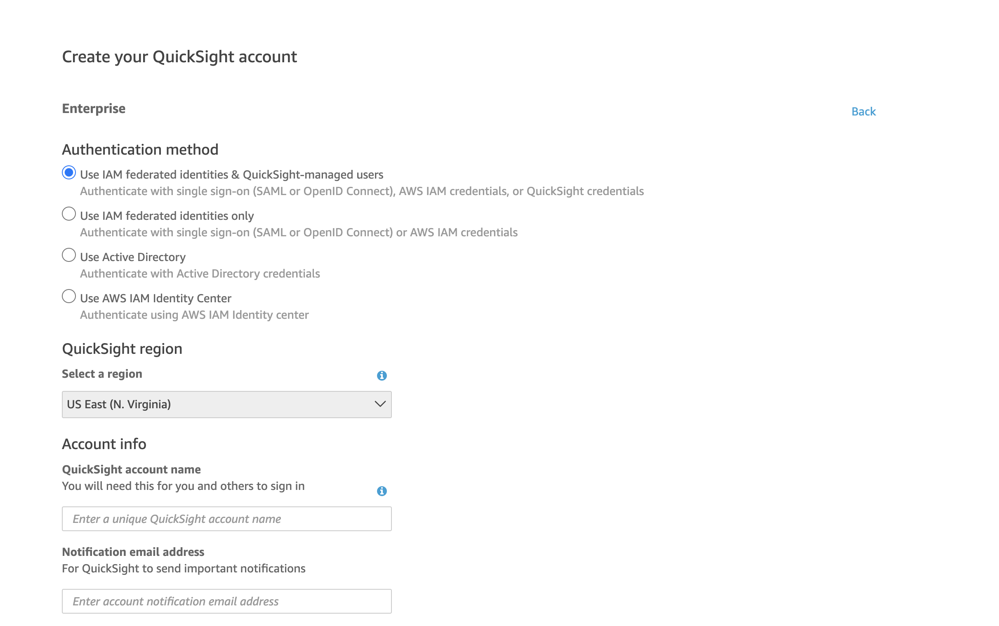
  
6. - Select the **region** in which you are deploying your cloud formation template.

7. - Enter QuickSight **account** name and Notification **email address**

8. - In IAM Role select Use **QuickSight-managed role** (default)

  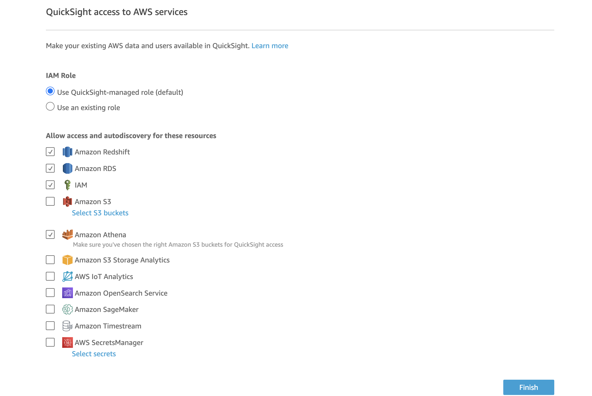

9. - In Allow access and autodiscovery for these resources select IAM, Amazon S3(select bucket which you are passing using paramter input), Selct Amazon Athena and select the s3 bucket(select bucket which you are passing using paramter input) and click on **Finish**.

10. - It will create your amazon QuickSight account.

11. - Now click on **datasets** from left panel and start adding your first dataset.

12. - Click on **New dataset** from top right corner.

13. - Select **Athena** as a data source.

  

14. - Provide data source name as **esfeeder-measurements** and click on **create data source**.

  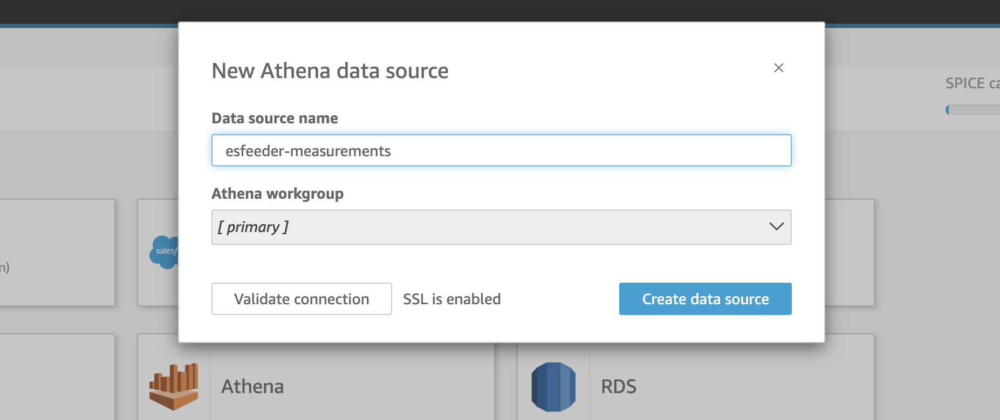

15. - Now click on **Use custom SQL**

  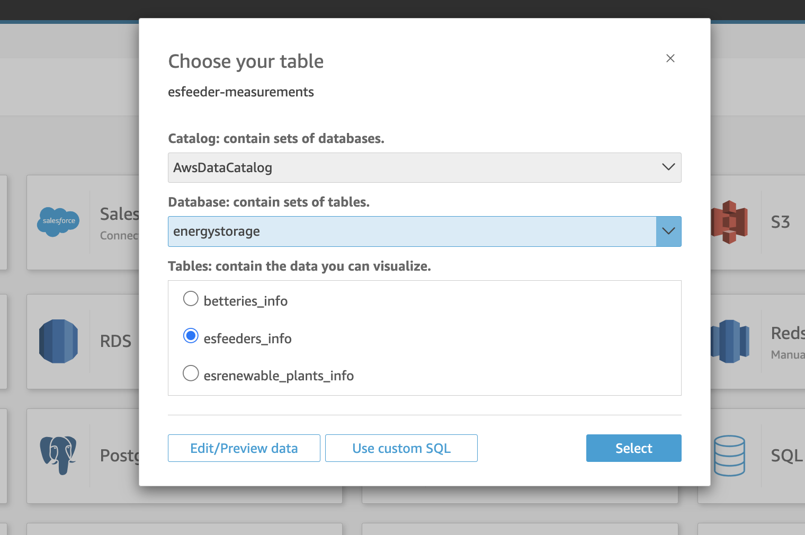

16. - Paste this query and click **Confirm query** button :
    **select * from energystorage.esfeeder_measurements**

17. - Then click on **visualise** to visualise your data.

  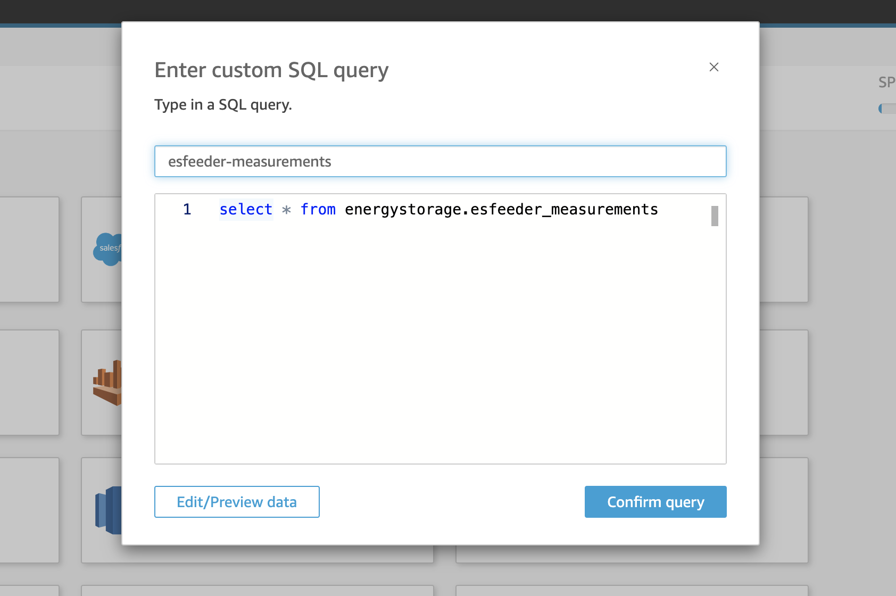

  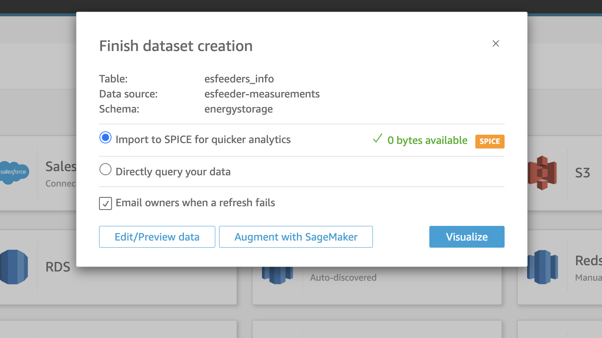

18. - Sample visualisation image 

  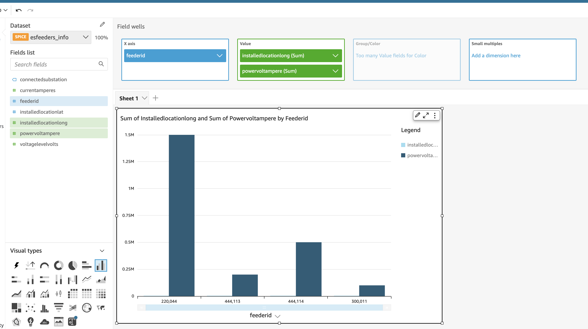

  # Follow the same step from 11 to 18 to visualize data from Forecast output. Change the Query and provide data source name forecast-output.

  - Query : **select * from energystorage1.forecast_output**

**To visualize the workflow, start the step function and check the corrresponding data to that in their respective location**

